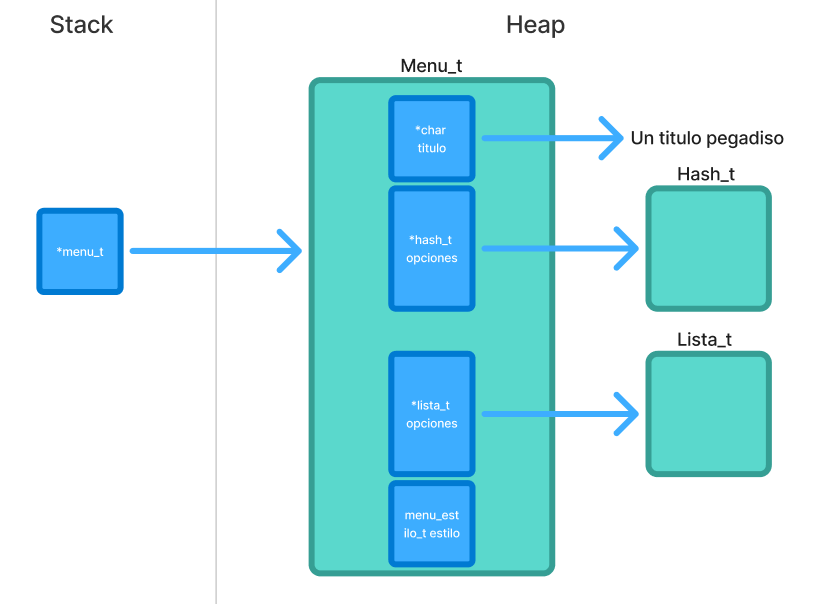
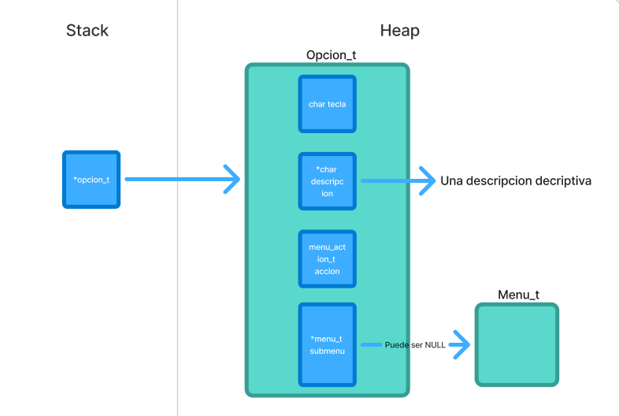
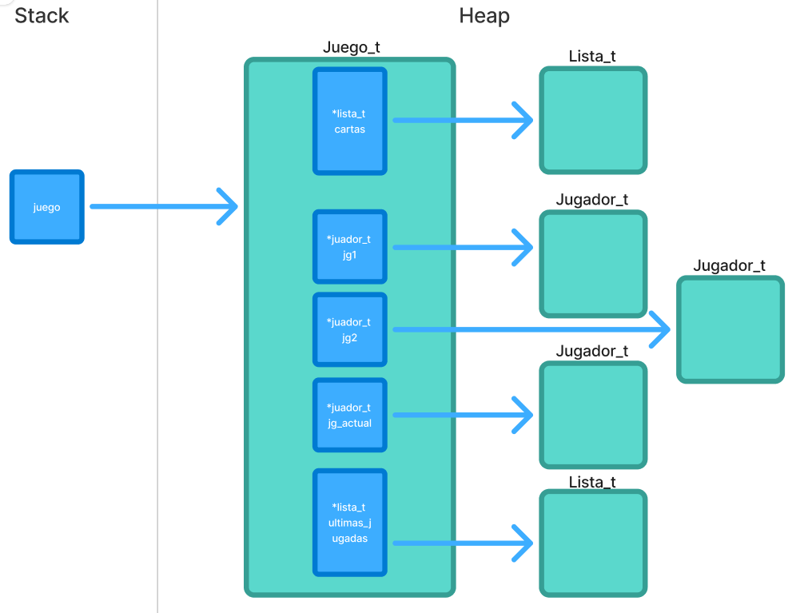
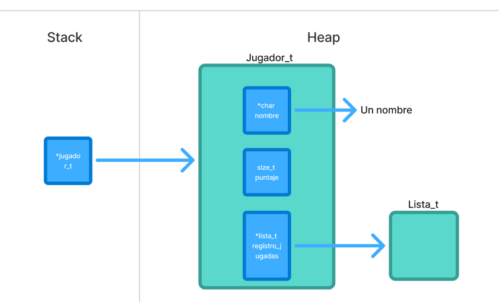
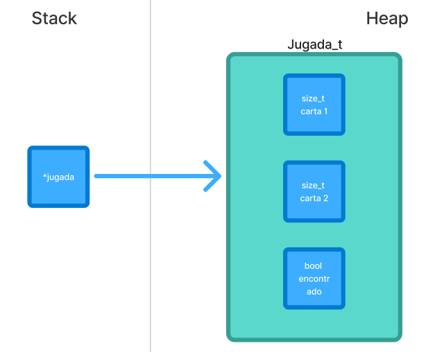

<div align="right">

</div>

# TP2

## Repositorio de Luca Frisoni - 113497 - lfrisoni@fi.uba.ar / frisoniluca1@gmail.com(Github)

- Para compilar:

```bash
make compilar
```

- Para ejecutar:

```bash
./programa
```

- Para ejecutar con valgrind:

```bash
make valgrind
```

#### Compilación y ejecución de tests

```bash
make compilar_t
```

Para ejecutar los tests:

```bash
./tests
```

Para ejecutar con valgrind:

```bash
make valgrind_t
```

---

## 🛠️Funcionamiento

### 🏛️Estructuras

Para este trabajo práctico se definieron distintas estructuras de datos que permiten organizar y manipular los elementos de forma eficiente.  
A continuación se detallan las estructuras principales:

---

#### 🔹`menu_t`

Representa un **menu** .

- Posee un titulo.
- Contiene una _tabla hash_ que almacena sus opciones.
- Contiene una _lista enlazada_ que guarda tambien opciones que prevalacen el orden de incersion.
- Tiene una ultima propiedad que guarda el enum de su estilo

📊 **Diagrama de memoria:**  


---

#### 🔹`opcion_t`

Representa una **opcion del menu**.

- Tiene una tecla que indica cuando debe de ser ejecutada.
- Tiene una descripcion.
- Posee una **menu_action_t** que define un tipo de funcion de accion del menu
- Contiene un **menu_t** que define si la opcion es un submenu o es una accion

📊 **Diagrama de memoria:**  


---

---

#### 🔹`juego_t`

Representa la estructura del **juego de la memoria pokemon**.

- Contien una _lista enlazada_ con todas las cartas.
- Posee un **jugador_t** 1,2 y el actual.
- Posee una ultima _lista enlazada_ con el historial de las ultimas 5 jugadas

📊 **Diagrama de memoria:**  


---

---

#### 🔹`jugador_t`

Representa un **jugador**.

- Tiene un nombre.
- Tiene su puntaje.
- Contiene una _lista enlazada_ que guarda los registros de sus jugadas

📊 **Diagrama de memoria:**  


---

---

#### 🔹`jugada_t`

Representa la **jugada** que realiza un jugador.

- Almacena el indice de la primera carta elejida.
- Almacena el indice de la segunda carta elejida.
- Contiene un booleano indicando si encontro el par o no.

📊 **Diagrama de memoria:**  


---

### ⚙️Funcionamiento General

---

### 1. Validación de parámetros

Antes de iniciar cualquier procesamiento, el programa valida que los parámetros de entrada sean correctos con `validando_params(argc, argv)`:

**📌¿Qué se valida?**

- 🔹Que se hayan pasado como máximo 2 parámetros: (`<ejecutable> <archivo.csv>`).
- 🔹Si se incluye un segundo parámetro, debe ser un archivo .csv que contenga los Pokémon del juego
- 🔹Si se pasa más de un archivo o parámetros incorrectos, el programa finaliza informando el error.

---

### 2.Flujo de Ejecución

---

### 2.1 Creacion y configuracion del menu

El programa construye:

- 🟦 Menú principal
- 🟪 Submenú Buscar
- 🟩 Submenú Mostrar

**📌¿Qué opciones se le agregan?:**

- 🔹 Cargar archivo.
- 🔹 Buscar Pokémon.
  1. Por Nombre
  2. Por id
  3. Ir a menu Anterior
- 🔹 Mostrar Pokémon.
  1. Por Nombre
  2. Por id
  3. Ir a menu Anterior
- 🔹 Jugar.
- 🔹 Jugar con semilla.
- 🔹 Cambiar estilo visual.
- 🔹 Salir.

Cada opción del menú está asociada a una acción predefinida del TP.
El programa organiza todas sus funcionalidades a través de este sistema de menú completamente modular.

---

### 2.2 Ejecucion del menu

La interacción con el usuario inicia con:

```c
ejecutar_menu(menu, sub_menu_buscar, sub_menu_mostrar, tp1);
```

**📌¿Qué hace esta funcion?:**

🌀 **Bucle de ejecución**

El menú se muestra continuamente hasta que el usuario elija Salir (Q).

🔐 **Validaciones adicionales**

Antes de permitir acceder a algunas opciones (como Buscar, Mostrar o Jugar), se verifica que:

- Se haya cargado un archivo.

- El archivo tenga suficientes Pokémon para jugar (mínimo 9).

🎛️ **Switch principal**

El programa maneja las teclas ingresadas por el usuario:

- C → Cargar un archivo

- B → Abrir submenú de búsqueda

- M → Abrir submenú de mostrar

- J → Jugar con pokémones cargados

- S → Jugar con semilla

- E → Cambiar estilo del menú

- Q → Salir del juego

Cada acción se ejecuta mediante `menu_ejecutar`, lo que desacopla la lógica del menú del código del programa.

---

### 3. Liberación de Memoria

Al finalizar la ejecución (Al presionar Q):

- 🗑️Se destruye el menú principal.
- 🗑️Se destruyen los submenus
- 🗑️Se libera la estructura principal del TP

Esto asegura que no queden memory leaks ni recursos sin liberar.

---

## Tests Unitarios

Esta sección describe cómo se verifican todas las funciones primitivas del proyecto mediante pruebas unitarias y de integracion.

### Objetivo

- 🔹Comprobar que cada función del proyecto se ejecute correctamente en distintos escenarios.
- 🔹Asegurar que las operaciones sobre las estructuras dinámicas se realicen sin errores de memoria.
- 🔹Validar el correcto funcionamiento de cada una de las Estructura de Datos.
- 🔹Confirmar que las funciones devuelvan los resultados esperados.
- 🔹Asegurarse el buen funcionamiento en casos demandantes

### Cobertura de pruebas

Se realizan 196 pruebas

Estos tests incluyen:

- 🔹**Pruebas de creacion**
- 🔹**Pruebas de incercion**
- 🔹**Pruebas de eliminacion**
- 🔹**Pruebas de liberacion de memoria**
- 🔹**Pruebas de combinacion de funciones**
- 🔹**Pruebas sobre getters y setters**
- 🔹**Pruebas de estres**

## 📈Complejidad computacional de las funciones primitivas

**Complejidad del menu**

- **`menu_crear`** → O(1)
  La complejidad de menu_crear es O(1) porque todas las operaciones que realiza —reservar memoria, copiar el título, crear la lista y crear el hash— son independientes del tamaño del menú o de la cantidad de opciones. Cada paso es una operación de tiempo constante, por lo que el tiempo total de ejecución también lo es.

- **`menu_cantidad`** → O(1)
  La función solo verifica un puntero y luego llama a lista_cantidad, que retorna directamente el campo interno que almacena la cantidad de elementos sin recorrer la lista. Todas las operaciones son accesos directos a memoria, por lo que la complejidad es constante.

- **`menu_agregar_opcion`** → O(n) en el peor caso, O(1) amortizado promedio
  La función realiza varias operaciones de tiempo constante (crear la opción, asignar memoria, copiar la tecla, insertar en la lista). La parte que domina la complejidad es la inserción en el hash: en promedio es O(1) amortizado, pero en el peor caso —si muchas claves colisionan— puede requerir recorrer hasta n elementos o disparar un rehash, lo cual es O(n). Por lo tanto, la complejidad total es O(1) en promedio, pero O(n) en el peor caso.

- **`menu_agregar_submenu`** → O(n) en el peor caso, O(1) amortizado promedio
  La función solo delega en menu_agregar, por lo que hereda exactamente su complejidad. Todas las operaciones internas son constantes excepto la inserción en el hash, que es O(1) amortizado pero O(n) en el peor caso si ocurre una fuerte colisión o un rehash. Por lo tanto, su complejidad temporal coincide con la de menu_agregar.

- **`menu_set_estilo`** → O(1)
  La función solo realiza validaciones simples y asigna un valor a un campo de la estructura. No recorre estructuras ni realiza operaciones dependientes del tamaño del menú, por lo que todas sus acciones son constantes. Por esto, su complejidad temporal es O(1) en todos los casos.

- **`menu_get_estilo`** → O(1)
  La función solo verifica si el puntero es válido y luego retorna directamente el campo estilo de la estructura. Ambas operaciones son de tiempo constante, sin recorridos ni cálculos adicionales. Por lo tanto, su complejidad es O(1) en todos los casos.

- **`menu_mostrar`** → O(n)

- **`menu_ejecutar`** → O(1) promedio, O(n) peor caso
  La función realiza operaciones constantes: crear una clave temporal, buscar la opción asociada y ejecutar su acción. La búsqueda en el hash es O(1) en el caso promedio, ya que se accede directamente al bucket calculado a partir de la tecla. Sin embargo, en el peor caso, si todas las claves colisionan en un mismo bucket, hash_buscar podría recorrer hasta n elementos, resultando en O(n). La llamada a la acción también es constante porque solo se ejecuta una función ya referenciada. Por lo tanto, la complejidad es O(1) promedio y O(n) en el peor caso.

- **`menu_destruir`** → O(n)
  La función libera todos los recursos del menú. Si existen opciones almacenadas, la lista se destruye recorriendo cada elemento una vez, lo que implica un costo lineal en la cantidad de opciones. Además, el hash asociado también destruye todas sus entradas, lo que igualmente recorre n elementos. El resto de las liberaciones son O(1). Por eso, la complejidad total es O(n).

**Complejidad de opcion**

- **`opcion_crear`** → O(1)
  La función solo realiza asignaciones, un calloc y la copia del string usando copiar_string, que en este diseño opera en tiempo constante. No hay bucles ni recorridos dependientes del tamaño de los datos. Por lo tanto, el tiempo de ejecución se mantiene constante y la complejidad es O(1).

- **`opcion_tecla`** → O(1)
  La función realiza únicamente una verificación de puntero y un acceso directo al campo tecla de la estructura. Ambas son operaciones constantes que no dependen del tamaño de la entrada ni requieren recorridos. Por lo tanto, su complejidad es O(1).

- **`opcion_descripcion`** → O(1)
  La función solo verifica que el puntero no sea nulo y devuelve el campo descripcion, que es un simple acceso directo dentro de la estructura. No realiza copias ni recorridos, por lo que su complejidad es O(1).

- **`opcion_accion`** → O(1)
  La función solo hace una verificación de puntero nulo y luego retorna el campo accion almacenado en la estructura. Es un acceso directo a memoria, sin recorridos ni operaciones adicionales, por lo que su complejidad es O(1).

- **`opcion_destruir`** → O(1)
  La función realiza únicamente operaciones constantes: verifica si el puntero es válido, libera la cadena descripcion y luego libera la estructura opcion. No recorre memoria dinámica ni realiza cálculos adicionales; libera exactamente dos bloques de memoria conocidos de antemano. Por lo tanto, su complejidad temporal es O(1).

**Complejidad de juego**

- **`juego_crear`** → O(n²) (teórico), O(n) práctico
  La función realiza solo operaciones constantes hasta llegar a cargar_cartas_random, que es la que determina toda la complejidad. Esa función recorre todos los pokémon del TP (n) y en cada iteración puede insertar elementos en una lista en posiciones arbitrarias, lo cual cuesta O(n). Por eso, en el análisis teórico el costo total es O(n²). Sin embargo, como la cantidad de cartas a insertar es fija y pequeña en el contexto del TP, el comportamiento real se aproxima más a O(n).

- **`juego_siguiente_jugador`** → O(1)
  La función solo realiza comparaciones y asignaciones entre punteros sin recorrer estructuras ni procesar datos adicionales. Todas las operaciones son constantes, por lo que la complejidad es O(1) en todos los casos.

- **`juego_jugador_1`** → O(1)
  La función únicamente verifica que el puntero recibido no sea nulo y devuelve un campo de la estructura. No realiza recorridos ni operaciones adicionales, por lo que su complejidad es O(1) siempre.

- **`juego_jugador_2`** → O(1)
  La función únicamente verifica que el puntero recibido no sea nulo y devuelve un campo de la estructura. No realiza recorridos ni operaciones adicionales, por lo que su complejidad es O(1) siempre.

- **`juego_jugador_actual`** → O(1)
  La función únicamente verifica que el puntero recibido no sea nulo y devuelve un campo de la estructura. No realiza recorridos ni operaciones adicionales, por lo que su complejidad es O(1) siempre.

- **`juego_carta_encontrada`** → O(n)
  La función realiza dos llamadas a `lista_buscar_elemento`, y dado que la estructura interna es una lista enlazada, acceder a una posición específica requiere recorrerla secuencialmente.
  Cada búsqueda cuesta O(n) y se realizan dos, pero constantes se descartan en notación Big-O

- **`juego_registrar_jugada`** → O(n)
  La función crea una jugada en tiempo constante y luego la registra tanto en el jugador actual como en la lista de “últimas 5 jugadas”, ambas operaciones de O(1).
  La única operación costosa aparece cuando **encontrada == true**: se realizan dos llamadas a `lista_eliminar_elemento`, que en una lista enlazada requieren recorrerla hasta la posición indicada. Cada eliminación cuesta O(n), por lo que el costo dominante es:
  O(n + n) = O(n)
  Si no se encuentra carta **(encontrada == false)**, todas las operaciones son constantes y sería O(1)

- **`juego_terminado`** → O(1)
  La función solo valida que el puntero a juego no sea NULL y luego llama a `lista_cantidad`, que en una lista enlazada simplemente devuelve un campo interno que se mantiene actualizado.
  No recorre la lista ni realiza cálculos adicionales.
  Por lo tanto, la complejidad es O(1) en todos los casos.

- **`juego_cartas_restantes`** → O(1)
  La función únicamente valida el puntero y devuelve la cantidad de elementos de la lista mediante `lista_cantidad`, que es un acceso directo al contador interno sin recorrer nodos.
  No realiza operaciones adicionales ni iteraciones.
  Por lo tanto, su complejidad es O(1).

- **`juego_cartas_lista`** → O(1)
  La función únicamente verifica que el puntero recibido no sea nulo y devuelve un campo de la estructura. No realiza recorridos ni operaciones adicionales, por lo que su complejidad es O(1) siempre.

- **`juego_ultimas_jugadas`** → O(1)
  La función únicamente verifica que el puntero recibido no sea nulo y devuelve un campo de la estructura. No realiza recorridos ni operaciones adicionales, por lo que su complejidad es O(1) siempre.

- **`juego_destruir`** → O(n)
  La función libera todos los recursos asociados al juego: destruye ambos jugadores, destruye la lista de cartas y la lista de últimas jugadas, y finalmente libera la estructura principal.
  Las destrucciones de listas recorren y liberan todos sus elementos, por lo que el tiempo total depende de la cantidad de nodos almacenados entre lista_cartas y ultimas_jugadas.
  En consecuencia, la operación requiere recorrer todos esos elementos una vez y su complejidad total es O(n).

**Complejidad de jugador**

- **`jugador_crear`** → O(n)
  La complejidad proviene de copiar el nombre del jugador, lo cual requiere recorrer todos sus caracteres.
  El resto de las operaciones son constantes.
  Por eso, la complejidad total es O(n), siendo n la longitud del nombre.

- **`jugador_obtener_nombre`** → O(1)
  Solo valida el puntero y devuelve una referencia interna sin copiar ni recorrer nada.
  No depende del tamaño del nombre ni de ningún otro dato.
  Por lo tanto, la complejidad es O(1).

- **`jugador_obtener_puntaje`** → O(1)
  Valida el puntero y devuelve un valor almacenado directamente en la estructura.
  No realiza recorridos ni operaciones dependientes del tamaño de ningún dato.
  Por lo tanto, la complejidad es O(1).

- **`jugador_sumar_puntaje`** → O(1)
  Solo valida el puntero y realiza una operación constante de incremento sobre un campo de la estructura.
  No depende del tamaño de ningún conjunto de datos.

- **`jugador_registrar_jugada`** → O(1)
  Verifica punteros y agrega un elemento al final de una lista enlazada simple usando `lista_agregar`, que inserta al final en tiempo constante porque mantiene puntero al último nodo.
  No hay recorridos ni operaciones proporcionales al tamaño.

- **`jugador_registro_jugadas`** → O(1)
  Solo valida el puntero y devuelve un campo de la estructura.
  No recorre nada ni hace trabajo proporcional al tamaño.

- **`jugador_destruir`** → O(n)
  Libera la lista de jugadas registrada por el jugador.
  Esa lista debe recorrerse elemento por elemento para destruir cada nodo y cada jugada.
  El resto de las operaciones (free del nombre, free de la estructura) son O(1).
  Por lo tanto, la complejidad total está dominada por la destrucción de la lista y es:
  O(n).

**Complejidad de jugada**

- **`jugada_crear`** → O(1)
  La operación solo reserva memoria para una estructura de tamaño fijo y asigna valores a sus campos.
  No depende de colecciones ni realiza recorridos.

- **`jugada_carta_1`** → O(1)
  La operación únicamente valida el puntero y devuelve un campo de la estructura.
  No realiza bucles ni recorridos, por lo que su tiempo no depende del tamaño de ningún conjunto de datos.

- **`jugada_carta_2`** → O(1)
  La operación únicamente valida el puntero y devuelve un campo de la estructura.
  No realiza bucles ni recorridos, por lo que su tiempo no depende del tamaño de ningún conjunto de datos.

- **`jugada_encontrado`** → O(1)
  La función solo valida el puntero y devuelve un valor booleano almacenado en la estructura.
  No requiere recorrer elementos ni realizar operaciones proporcionales al tamaño de datos.

- **`jugada_destruir`** → O(1)
  La función únicamente valida el puntero, hace un cast y libera memoria.
  No recorre estructuras ni depende del tamaño de los datos.

## 📚 Respuestas a las preguntas teóricas

### 1. ¿Qué TDAs fueron utilizados para implementar las funcionalidades pedidas? ¿Por qué fue elegido ese TDA y no otro?

Para el menú se utilizaron dos TDAs combinados: hash y lista. El hash se eligió porque permite búsquedas de una opción en O(1), lo que optimiza la ejecución cuando el usuario presiona una tecla. Sin embargo, como también era necesario mantener el orden de inserción de las opciones para mostrarlas en pantalla de forma consistente, se combinó con una lista que almacena las opciones en el orden en que fueron agregadas. Esta combinación permitió tanto rapidez en la búsqueda como preservación del orden de presentación.

En el juego y los jugadores, se utilizó principalmente listas. Esto se debe a que era necesario guardar las cartas y las jugadas, mantener su orden y poder operar con índices para mostrar cartas o registrar jugadas de forma controlada. La lista resultó adecuada porque permite inserciones, eliminaciones y recorridos secuenciales de manera eficiente, adaptándose a las operaciones requeridas por la lógica del juego.

### 2. Explicar el TDA menú. Justifique las operaciones incluídas en el TDA.

El TDA menú fue diseñado para agrupar todas las operaciones necesarias para manejar el menú del TP2 de manera modular y eficiente. Incluye solo las operaciones que se utilizaron realmente en el proyecto: crear un menú, agregar opciones y submenús, ejecutar acciones según la tecla presionada, obtener o modificar el estilo y finalmente liberar los recursos.

Si bien podrían haberse implementado muchas más funcionalidades —como buscar opciones por descripción, eliminar opciones, modificar acciones o cambiar el orden, se decidió mantenerlo simple y específico para este TP2. Esto permite que el TDA cumpla con su objetivo de manejar menús y submenús de manera clara, ordenada y eficiente, evitando complejidad innecesaria. La misma filosofía se aplicó a los jugadores,juego y sus jugadas, manteniendo solo las operaciones estrictamente necesarias.

### 3. Explicar cualquier otro TDA o estructuras auxiliares implementadas.

Además del menú y del juego, se implementaron otras estructuras que funcionan como TDAs auxiliares: las opciones, los jugadores y las jugadas. Estas estructuras están bien abstraídas y encapsulan la información y operaciones que necesitan manejar de forma independiente.

Aunque son más pequeñas y dependen de los TDAs principales, cumplen un rol clave: las opciones permiten asociar acciones a teclas dentro del menú, los jugadores almacenan su nombre, puntaje y registro de jugadas, y las jugadas registran cada movimiento del juego. Estas estructuras podrían ampliarse con más funcionalidades, pero para este TP2 se mantuvieron simples y enfocadas en el uso que requieren los TDAs principales, garantizando claridad y modularidad.

### 4. Explique qué dificultades encontró al implementar el TP2 y cómo pudo solucionarlas.

Las principales dificultades surgieron en la interfaz visual del juego, especialmente al mostrar las cartas de manera ordenada por filas y no una por una, lo que requería pensar cuidadosamente cómo organizar la impresión y el control del flujo. También fue un reto inicial planificar la estructura del juego, decidir cómo manejar las cartas y los jugadores, y cómo conectar las acciones dentro del menú con la lógica del juego.

Durante la implementación, se hicieron ajustes en el diseño: por ejemplo, se eliminó la estructura intermedia de carta y se optó por manejar directamente los Pokémones, lo que resultó más simple, eficiente y directo para las operaciones del juego.
